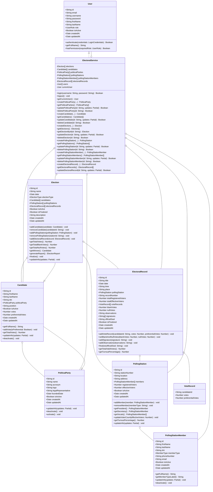

```mermaid
classDiagram
  class User {
    +String id
    +String email
    +String username
    +String password
    +String firstName
    +String lastName
    +UserRole role
    +Boolean isActive
    +Date createdAt
    +Date updatedAt
    +authenticate(credentials: LoginCredentials) Boolean
    +getFullName() String
    +hasPermission(requiredRole: UserRole) Boolean
  }
  class PoliticalParty {
    +String id
    +String name
    +String acronym
    +String logo
    +String legalRepresentative
    +Date foundedDate
    +Boolean isActive
    +Date createdAt
    +Date updatedAt
    +updateInfo(updates: Partial<PoliticalParty>) void
    +deactivate() void
    +activate() void
  }
  class Candidate {
    +String id
    +String firstName
    +String lastName
    +String dni
    +PoliticalParty politicalParty
    +String position
    +Boolean isActive
    +Number votes
    +Number preferentialVotes
    +Date createdAt
    +Date updatedAt
    +getFullName() String
    +addVote(isPreferential: Boolean) void
    +getTotalVotes() Number
    +updateInfo(updates: Partial<Candidate>) void
    +deactivate() void
  }
  class Election {
    +String id
    +String name
    +Date date
    +ElectionType electionType
    +Candidate[] candidates
    +PollingStation[] pollingStations
    +ElectoralRecord[] electoralRecords
    +Boolean isActive
    +Boolean isFinalized
    +String description
    +Date createdAt
    +Date updatedAt
    +addCandidate(candidate: Candidate) void
    +removeCandidate(candidateId: String) void
    +addPollingStation(pollingStation: PollingStation) void
    +removePollingStation(stationId: String) void
    +addElectoralRecord(record: ElectoralRecord) void
    +getTotalVotes() Number
    +getTotalBlankVotes() Number
    +getTotalNullVotes() Number
    +getWinner() Candidate
    +generateReport() ElectionReport
    +finalize() void
    +updateInfo(updates: Partial<Election>) void
  }
  class PollingStation {
    +String id
    +String stationNumber
    +String location
    +String address
    +PollingStationMember[] members
    +Number registeredVoters
    +Number effectiveVoters
    +Boolean isActive
    +Date createdAt
    +Date updatedAt
    +addMember(member: PollingStationMember) void
    +removeMember(memberType: String) void
    +getPresident() PollingStationMember
    +getSecretary() PollingStationMember
    +getVocals() PollingStationMember[]
    +updateVoterCount(effectiveVoters: Number) void
    +getTurnoutPercentage() Number
    +updateInfo(updates: Partial<PollingStation>) void
  }
  class PollingStationMember {
    +String id
    +String firstName
    +String lastName
    +String dni
    +MemberType memberType
    +String phoneNumber
    +String email
    +Boolean isActive
    +Date createdAt
    +Date updatedAt
    +getFullName() String
    +getMemberTypeLabel() String
    +updateInfo(updates: Partial<PollingStationMember>) void
    +deactivate() void
  }
  class ElectoralRecord {
    +String id
    +String title
    +Date date
    +String time
    +String place
    +PollingStation pollingStation
    +String recordNumber
    +Number totalRegisteredVoters
    +Number totalEffectiveVoters
    +VoteRecord[] voteRecords
    +Number blankVotes
    +Number nullVotes
    +String observations
    +String[] signatures
    +String officialSeal
    +Boolean isFinalized
    +Date createdAt
    +Date updatedAt
    +addVoteRecord(candidateId: String, votes: Number, preferentialVotes: Number) void
    +setBlankAndNullVotes(blankVotes: Number, nullVotes: Number) void
    +addSignature(signature: String) void
    +addObservation(observations: String) void
    +finalize(officialSeal: String) void
    +getTotalValidVotes() Number
    +getTurnoutPercentage() Number
  }
  class VoteRecord {
    +String candidateId
    +Number votes
    +Number preferentialVotes
  }
  class ElectoralService {
    -Election[] elections
    -Candidate[] candidates
    -PoliticalParty[] politicalParties
    -PollingStation[] pollingStations
    -PollingStationMember[] pollingStationMembers
    -ElectoralRecord[] electoralRecords
    -User[] users
    -User currentUser
    +login(username: String, password: String) Boolean
    +logout() void
    +getCurrentUser() User
    +createPoliticalParty(...) PoliticalParty
    +getPoliticalParties() PoliticalParty[]
    +updatePoliticalParty(id: String, updates: Partial<PoliticalParty>) Boolean
    +deletePoliticalParty(id: String) Boolean
    +createCandidate(...) Candidate
    +getCandidates() Candidate[]
    +updateCandidate(id: String, updates: Partial<Candidate>) Boolean
    +deleteCandidate(id: String) Boolean
    +createElection(...) Election
    +getElections() Election[]
    +getElectionById(id: String) Election
    +updateElection(id: String, updates: Partial<Election>) Boolean
    +deleteElection(id: String) Boolean
    +createPollingStation(...) PollingStation
    +getPollingStations() PollingStation[]
    +updatePollingStation(id: String, updates: Partial<PollingStation>) Boolean
    +deletePollingStation(id: String) Boolean
    +createPollingStationMember(...) PollingStationMember
    +getPollingStationMembers() PollingStationMember[]
    +updatePollingStationMember(id: String, updates: Partial<PollingStationMember>) Boolean
    +deletePollingStationMember(id: String) Boolean
    +createElectoralRecord(...) ElectoralRecord
    +getElectoralRecords() ElectoralRecord[]
    +updateElectoralRecord(id: String, updates: Partial<ElectoralRecord>) Boolean
  }

  User <|.. ElectoralService
  PoliticalParty <|-- Candidate
  Candidate <|-- Election
  Election o-- Candidate
  Election o-- PollingStation
  Election o-- ElectoralRecord
  Candidate o-- PoliticalParty
  PollingStation o-- PollingStationMember
  ElectoralRecord o-- PollingStation
  ElectoralRecord o-- VoteRecord
  ElectoralService o-- Election
  ElectoralService o-- Candidate
  ElectoralService o-- PoliticalParty
  ElectoralService o-- PollingStation
  ElectoralService o-- PollingStationMember
  ElectoralService o-- ElectoralRecord
  ElectoralService o-- User
```